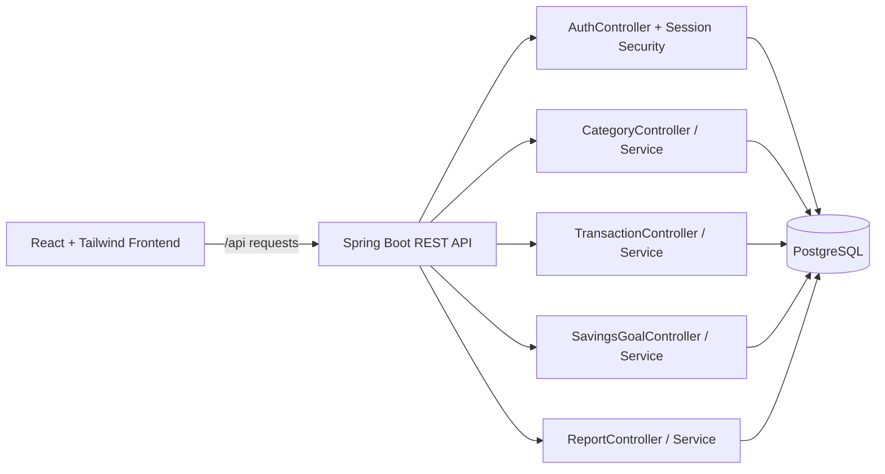
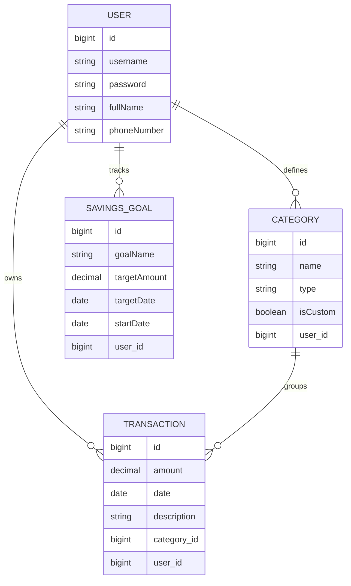
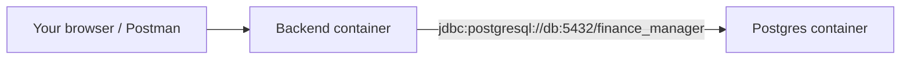

# Personal Finance Manager

A Spring Boot REST API for managing personal finances — track income, expenses, savings goals, and generate reports.

[](https://github.com/Ishan756/syfe_assignment/actions/workflows/ci.yml)
[](target/site/jacoco/index.html)

<!-- Demo video -->
## Demo Video

[Watch the demo video (Google Drive)](https://drive.google.com/file/d/114XqTD8SkB5xzTqnGgTTlvDrdc6mFrEL/view?usp=sharing)

---

## Architecture Diagram



## ER Diagram



## API Examples

### Register
```json
{
  "name": "Test User",
  "email": "test@example.com",
  "password": "Password123"
}
```

### Login
```json
{
  "email": "test@example.com",
  "password": "Password123"
}
```

### Create Goal
```json
{
  "goalName": "Emergency Fund",
  "targetAmount": 5000.0,
  "targetDate": "2026-12-01",
  "startDate": "2025-01-01"
}
```

### Create Transaction
```json
{
  "amount": 100.0,
  "date": "2026-06-01",
  "category": "Salary",
  "description": "Monthly salary"
}
```

### Sample Success Response
```json
{
  "id": 1,
  "goalName": "Emergency Fund",
  "targetAmount": 5000.0,
  "targetDate": "2026-12-01",
  "startDate": "2025-01-01"
}
```

---

## Tradeoffs

- Session-based auth is simpler for the assignment and works well with a browser frontend, but it is less stateless than JWT.
- Categories are deleted by `name` instead of `id` to match the existing API and frontend flow, which is easy to use but slightly less flexible.
- The frontend is intentionally lightweight and focused on assignment coverage rather than a full production UX.
- Docker runs the backend and database together, but the frontend is still kept as a separate dev/build app.

## Assumptions

- Each user only sees and manages their own transactions, categories, and savings goals.
- Category names are unique per user.
- Dates are submitted in `YYYY-MM-DD` format.
- The database is PostgreSQL in normal runs and H2 during tests.
- The deployed frontend, if added later, will call the backend through `/api` or an equivalent configured base URL.

## Future Improvements

- Add delete-by-id for categories to match the other resources.
- Serve the built frontend from Spring Boot for a single deployable artifact.
- Add end-to-end tests for the main user flows.
- Add export/import for transactions and reports.
- Add pagination and sorting for transaction and goal listing.
- Add actual cloud deployment and wire the live URL here.

## Screenshots

The repository includes demo screenshots showing the main flows (login, dashboard, transactions, and goals). Images are referenced from the `screenshots/` folder:

- 
- 
- 
- 
- 

If the images are not present locally, add the PNG files to `screenshots/` with the filenames above so they render on GitHub.

## Deployment Link

Deployment is not published yet. Add the live link here after deployment, for example:

- Frontend (Vercel): [https://syfe-assignment-sand.vercel.app/](https://syfe-assignment-sand.vercel.app/)
- Backend (Render): [https://syfe-assignment-1.onrender.com/](https://syfe-assignment-1.onrender.com/)

## Deploying on Render

Render is a good fit for this project if you deploy the backend and database as separate services.

### What to create

1. A **Web Service** for the Spring Boot backend.
2. A **PostgreSQL** database from Render's managed database option.

### Backend setup

1. Push this repository to GitHub.
2. In Render, create a new **Web Service** and connect the repo.
3. Choose **Docker** as the environment.
4. Render will use the root-level [Dockerfile](Dockerfile) to build the backend image.
5. Set the service to listen on the platform port. The app already supports Render's `PORT` variable through `application.properties`.

### Database setup

1. Create a new **PostgreSQL** instance on Render.
2. Copy the database connection details from Render.
3. In the backend web service, set these environment variables:
  - `SPRING_DATASOURCE_URL`
  - `SPRING_DATASOURCE_USERNAME`
  - `SPRING_DATASOURCE_PASSWORD`

### Suggested values

Use the Render PostgreSQL connection info for the datasource variables. The final URL usually looks like:

```text
jdbc:postgresql://<host>:5432/<database>
```

### Build and start

If you use the Dockerfile, Render handles the build automatically. If you prefer a non-Docker web service, use:

- Build command: `mvn clean package -DskipTests`
- Start command: `java -jar target/finance-manager-0.0.1-SNAPSHOT.jar`

### After deployment

1. Open the Render backend URL and confirm it responds.
2. Update the frontend API base URL to the Render backend URL.
3. Add your frontend domain to CORS in [SecurityConfig.java](src/main/java/com/financemanager/config/SecurityConfig.java) if needed.

---

## Tech Stack

- Java 17
- Spring Boot 3.2
- Spring Security (session-based auth)
- Spring Data JPA + Hibernate
- PostgreSQL
- Maven
- JUnit 5 + Mockito

---

## Prerequisites

- Java 17+
- Maven 3.8+
- PostgreSQL 14+

## Docker Setup

The backend and database can also run in Docker with the included `Dockerfile` and `docker-compose.yml`.

```bash
docker compose up --build
```

This starts:
- PostgreSQL on `localhost:5432`
- Spring Boot on `localhost:8080`

The backend reads these environment variables when running in Docker:
- `SPRING_DATASOURCE_URL`
- `SPRING_DATASOURCE_USERNAME`
- `SPRING_DATASOURCE_PASSWORD`
- `SERVER_PORT`

### How Docker Works Here

This setup uses **two containers** and **two images**:

- The `db` service uses the ready-made `postgres:16-alpine` image.
- The `backend` service builds a custom image from the project [Dockerfile](Dockerfile).

They run on the same Docker Compose network, so the backend reaches Postgres using the service name `db` instead of `localhost`.



#### In simple words

- The **image** is the blueprint.
- The **container** is the running instance of that blueprint.
- Compose starts the DB container first, then the backend container.
- The backend container waits until Postgres is healthy before starting.
- Data is stored in a Docker volume, so the database does not reset every time you restart containers.

#### Not the same container

The backend and database are **not** in the same container. They are separate containers because:

- one container should do one job well
- the database needs persistent storage and its own process
- the backend can be rebuilt and restarted independently

---

## PostgreSQL Setup

If you want to run the backend directly on your machine without Docker, create the database manually:

```sql
CREATE DATABASE finance_manager;
CREATE USER postgres WITH PASSWORD 'postgres';
GRANT ALL PRIVILEGES ON DATABASE finance_manager TO postgres;
```

Or update `src/main/resources/application.properties` with your own credentials:

```properties
spring.datasource.url=jdbc:postgresql://localhost:5432/finance_manager
spring.datasource.username=your_username
spring.datasource.password=your_password
```

---

## How to Run

```bash
# Clone the repo
git clone https://github.com/your-username/finance-manager.git
cd finance-manager

# Build and run
mvn spring-boot:run
```

The app starts on `http://localhost:8080`.

Default categories (Salary, Food, Rent, etc.) are auto-seeded on first startup.

---

## Frontend

A simple React + Tailwind frontend lives in `frontend/`.

### Frontend Prerequisites

- Node.js 18+
- npm 9+

### Run the Frontend

```bash
cd frontend
npm install
npm run dev
```

The dev server runs on `http://localhost:5173` and proxies `/api` requests to the Spring Boot backend on `http://localhost:8080`.

### Optional Production Build

```bash
cd frontend
npm run build
```

The build output is written to `frontend/dist`.

---

## Running Tests

```bash
mvn test
```

Tests use H2 in-memory database — no PostgreSQL needed for testing.

---

## Authentication

This API uses **session-based authentication with cookies**.

1. Register at `POST /api/auth/register`
2. Login at `POST /api/auth/login` — you'll receive a `JSESSIONID` cookie
3. Include that cookie in all subsequent requests
4. Logout at `POST /api/auth/logout` to invalidate the session

All endpoints except `/api/auth/register` and `/api/auth/login` require a valid session.

---

## API Overview

### Auth
| Method | Endpoint | Description |
|--------|----------|-------------|
| POST | `/api/auth/register` | Register a new user |
| POST | `/api/auth/login` | Login |
| POST | `/api/auth/logout` | Logout |

### Transactions
| Method | Endpoint | Description |
|--------|----------|-------------|
| POST | `/api/transactions` | Create a transaction |
| GET | `/api/transactions` | Get all transactions (supports filters) |
| PUT | `/api/transactions/{id}` | Update a transaction |
| DELETE | `/api/transactions/{id}` | Delete a transaction |

Filter params: `?startDate=2024-01-01&endDate=2024-01-31&categoryId=1`

### Categories
| Method | Endpoint | Description |
|--------|----------|-------------|
| GET | `/api/categories` | Get all categories (default + custom) |
| POST | `/api/categories` | Create a custom category |
| DELETE | `/api/categories/{name}` | Delete a custom category |

### Savings Goals
| Method | Endpoint | Description |
|--------|----------|-------------|
| POST | `/api/goals` | Create a goal |
| GET | `/api/goals` | Get all goals |
| GET | `/api/goals/{id}` | Get a specific goal |
| PUT | `/api/goals/{id}` | Update a goal |
| DELETE | `/api/goals/{id}` | Delete a goal |

### Reports
| Method | Endpoint | Description |
|--------|----------|-------------|
| GET | `/api/reports/monthly/{year}/{month}` | Monthly report |
| GET | `/api/reports/yearly/{year}` | Yearly report |

---

## Sample Requests

### Register
```bash
curl -c cookies.txt -X POST http://localhost:8080/api/auth/register \
  -H "Content-Type: application/json" \
  -d '{"username":"user@example.com","password":"password123","fullName":"John Doe","phoneNumber":"+1234567890"}'
```

### Login
```bash
curl -c cookies.txt -X POST http://localhost:8080/api/auth/login \
  -H "Content-Type: application/json" \
  -d '{"username":"user@example.com","password":"password123"}'
```

### Create Transaction
```bash
curl -b cookies.txt -X POST http://localhost:8080/api/transactions \
  -H "Content-Type: application/json" \
  -d '{"amount":50000.00,"date":"2024-01-15","category":"Salary","description":"January Salary"}'
```

### Get Monthly Report
```bash
curl -b cookies.txt http://localhost:8080/api/reports/monthly/2024/1
```

---

## Deploying to Render

1. Push your code to a public GitHub repo
2. Go to [render.com](https://render.com) and create a new **Web Service**
3. Connect your GitHub repo
4. Set build command: `mvn clean package -DskipTests`
5. Set start command: `java -jar target/finance-manager-0.0.1-SNAPSHOT.jar`
6. Add a **PostgreSQL** database on Render and set environment variables:
   - `SPRING_DATASOURCE_URL`
   - `SPRING_DATASOURCE_USERNAME`
   - `SPRING_DATASOURCE_PASSWORD`
7. Add to `application.properties` to read env vars:
```properties
spring.datasource.url=${SPRING_DATASOURCE_URL}
spring.datasource.username=${SPRING_DATASOURCE_USERNAME}
spring.datasource.password=${SPRING_DATASOURCE_PASSWORD}
```

---

## Error Response Format

All errors return a simple JSON body:
```json
{ "message": "Category already exists" }
```

Status codes used: `400`, `401`, `403`, `404`, `409`
